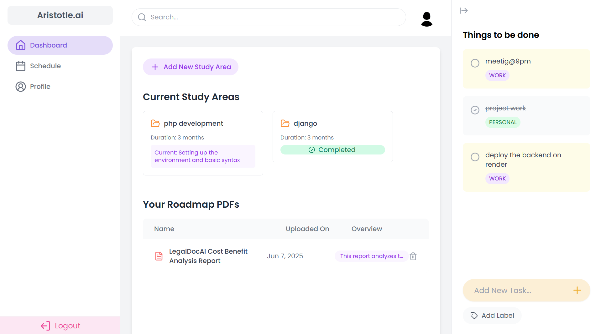
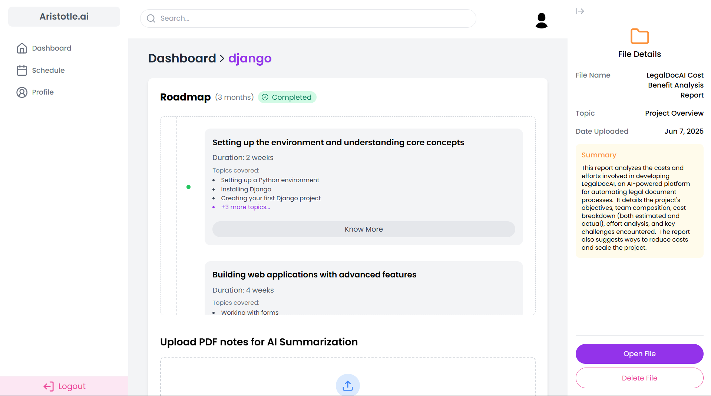
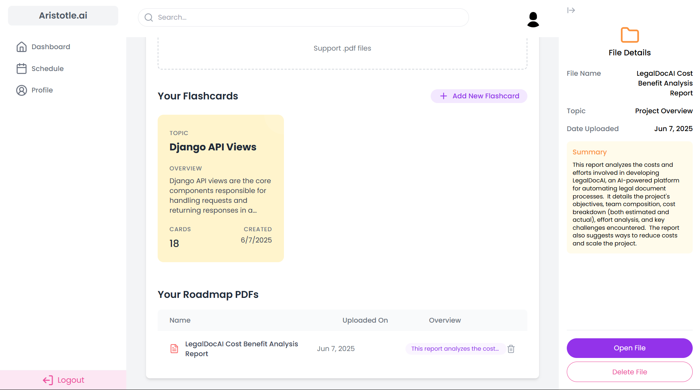
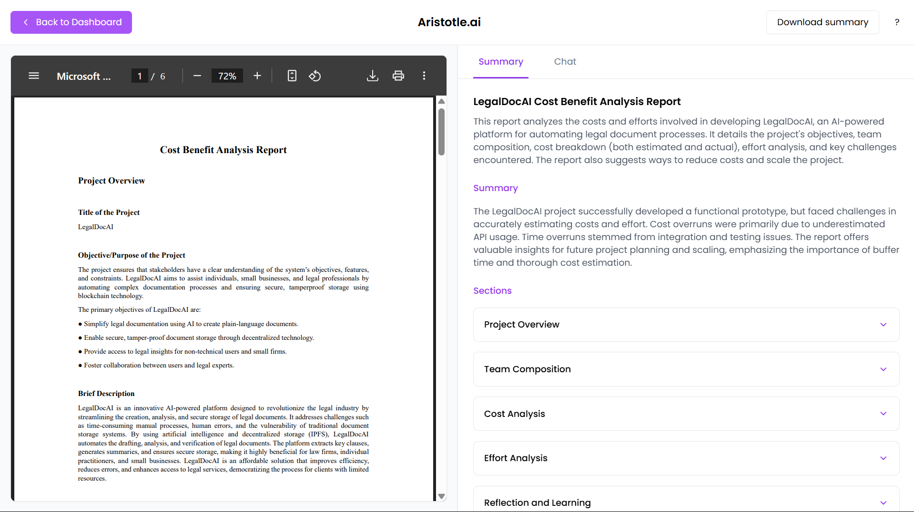
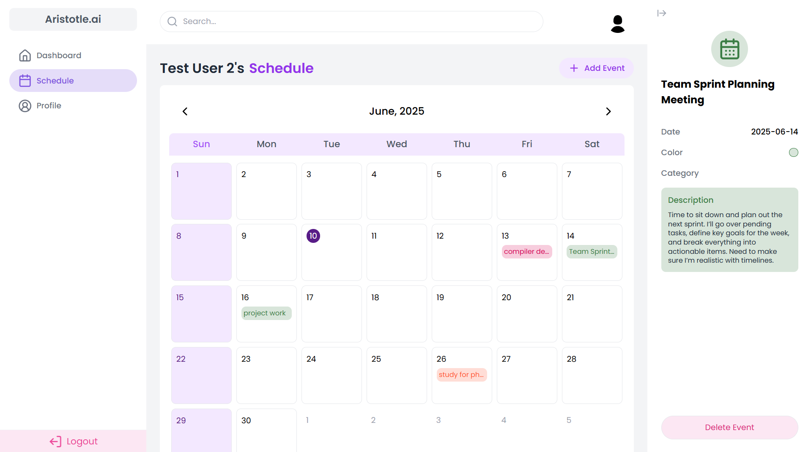
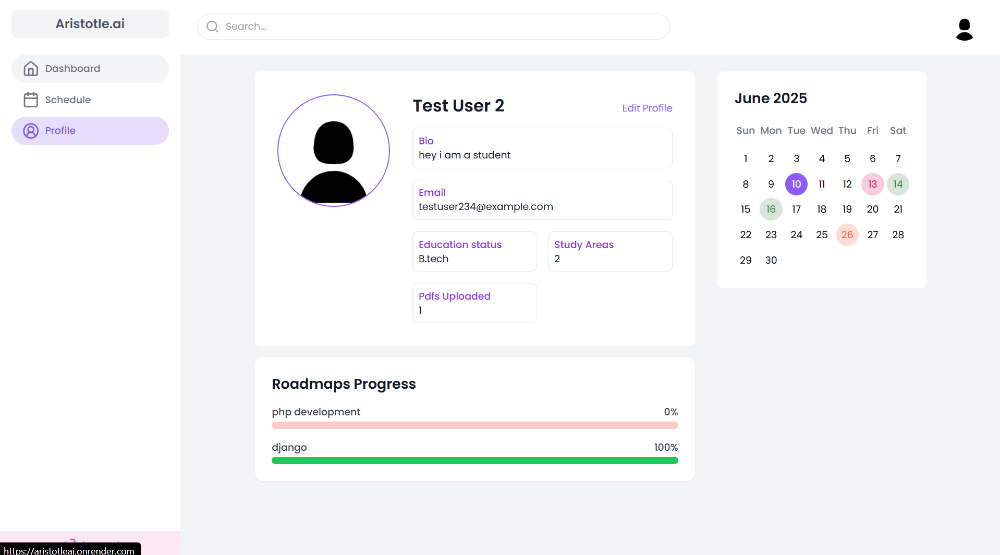

# Aristotle.ai

Aristotle.ai is a **student productivity management app** built with **React.js** and **Django**, leveraging **Gemini AI** for intelligent content generation. It is designed to help students organize their study plans, track progress, and interact with AI for PDF summarization and chat functionality.

## Features

✅ **Roadmap Generation & Tracking** - Create, customize, and track study roadmaps.
✅ **Schedule Tracking** - Manage study schedules with reminders and deadlines.
✅ **AI-powered PDF Summarization & Chat** - Upload PDFs, get AI-generated summaries, and chat with the document.
✅ **Multiple Roadmap & Study Area Management** - Organize studies into different subjects or areas.
✅ **To-Do List with Labels** - Efficient task management with labeled categorization.

## Tech Stack

- **Frontend:** React.js
- **Backend:** Django & Django REST Framework
- **AI Integration:** Gemini AI
- **Database:** PostgreSQL
- **Authentication:** JWT-based authentication

## Screenshots

Here are some screenshots showcasing Aristotle.ai in action:

| Screenshot | Description |
|------------|-------------|
|  | A glance at the main dashboard, showing active roadmaps and upcoming tasks. |
|  | Creating a new study roadmap with customizable steps and deadlines. |
|  | Managing flashcards and PDFs related to specific roadmap. |
|  | Interacting with the AI for PDF summarization and asking questions about the document. |
|  | A view of the integrated study schedule, highlighting deadlines and events. |
|  | User profile view to provide a glance at overall progress. |

## Installation

### Prerequisites

Ensure you have the following installed:

- Node.js & npm
- Python & pip
- PostgreSQL

### Backend Setup (Django)

```bash
git clone [https://github.com/yourusername/aristotle-ai.git](https://github.com/yourusername/aristotle-ai.git)
cd aristotle-ai/backend

# Create virtual environment
python -m venv venv
source venv/bin/activate   # For Windows use: venv\Scripts\activate

# Install dependencies
pip install -r requirements.txt

# Run migrations
python manage.py migrate

# Start server
python manage.py runserver
```

### Frontend Setup (React)

```bash
# Navigate to frontend directory
cd frontend

# Install dependencies
npm install

# Start development server
npm run dev  # Since this is a Vite project based on the vite.config.js

```
